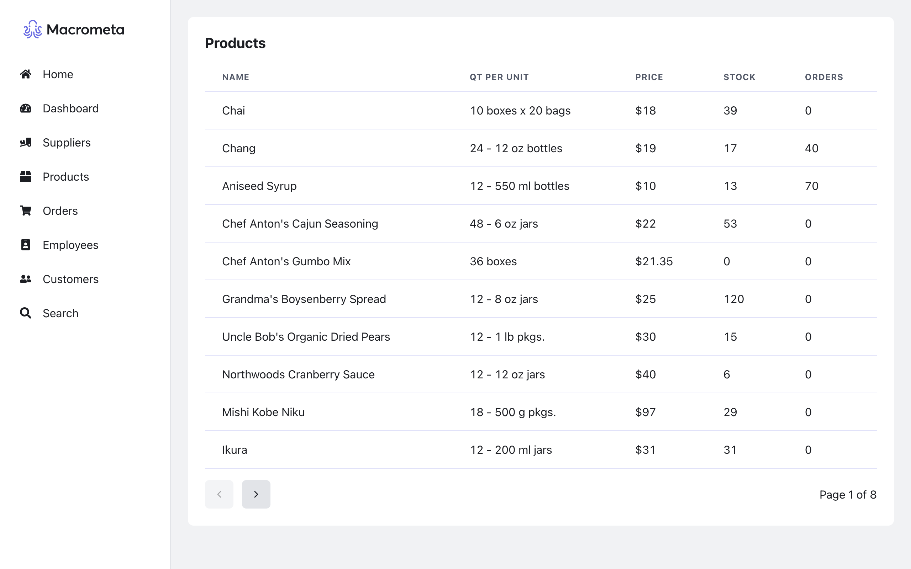

# Northwind Traders
:sparkles: Live Demo: https://macrometacorp.github.io/demo-northwind-traders/

## Overview
This is a demo of the Northwind Traders dataset, running on Macrometa.  



## More Info
Macrometa resources were created in:  
**Federation**: `play.macrometa.io`  
**Fabric**: `_system`  

## Run it Locally
### Prerequisites
You will have to had Node.js 18 (or later) installed in your system. Run the following command in your CLI to check your Node.js version.
```
node -v 
```
### Steps
1\. Open a CLI and run the command below to clone this repository. You can do:
```
git clone https://github.com/Macrometacorp/demo-northwind-traders.git
```
or 
```
git clone git@github.com:Macrometacorp/demo-northwind-traders.git
```
depending on your GitHub authentication method.  

2\. Change directory to your new project with:
```
cd demo-northwind-traders
```

3\. Create a new `.env.local` file and add your environment variables there.  
Here is how `.env.local` file should look like:
```
REACT_APP_FUNCTIONS_PLATFORM_BASE_URL=https://macrometa-akamai-ew.macrometa.io
REACT_APP_FABRIC_NAME=my_fabric
REACT_APP_API_KEY=...
```
**Note**: `.env.sample` is only an sample file that you can also use as a guide.  

4\. Install the project dependencies with:
```
npm install
```

5\. Run:
```
npm start
```
to start a local development server on `http://localhost:3000`
